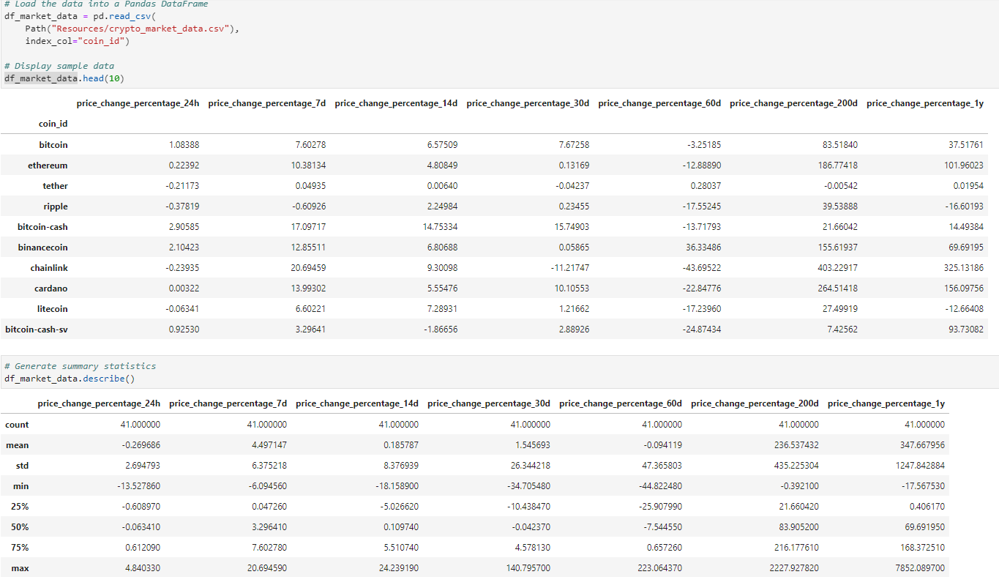
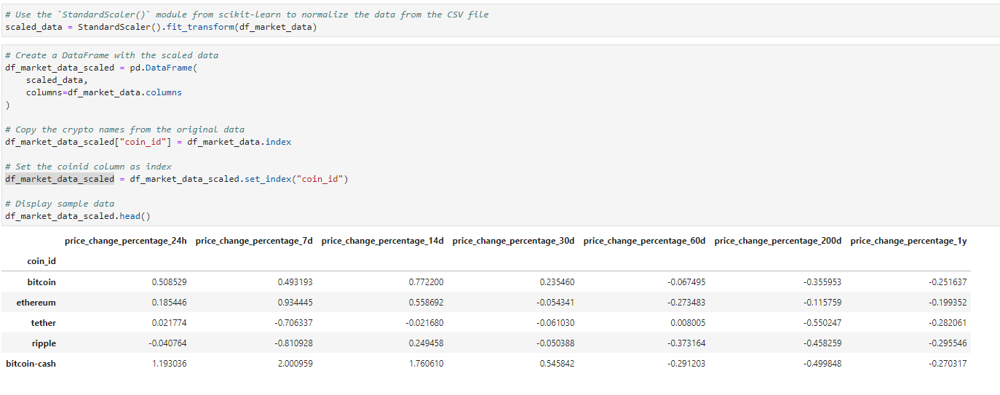
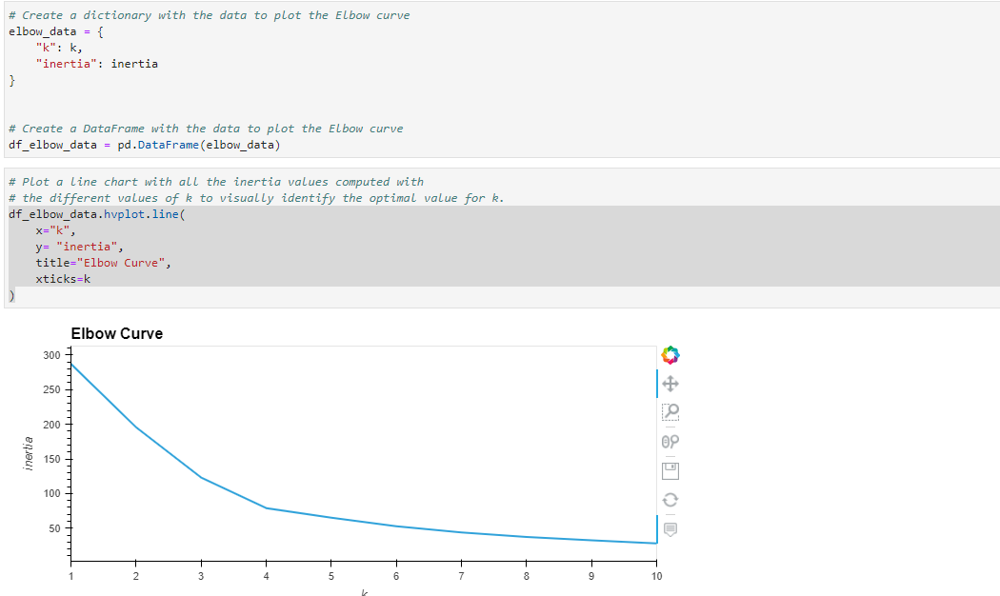
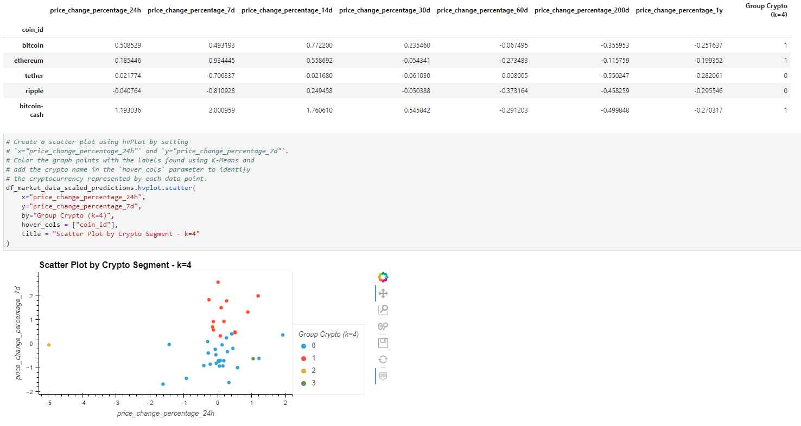
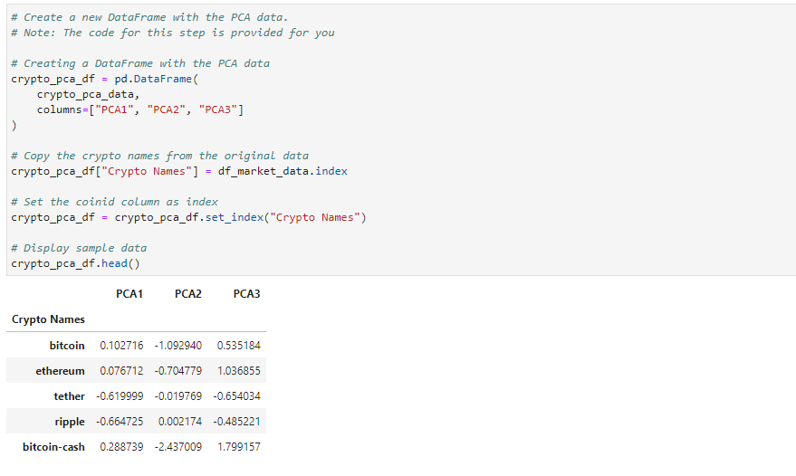
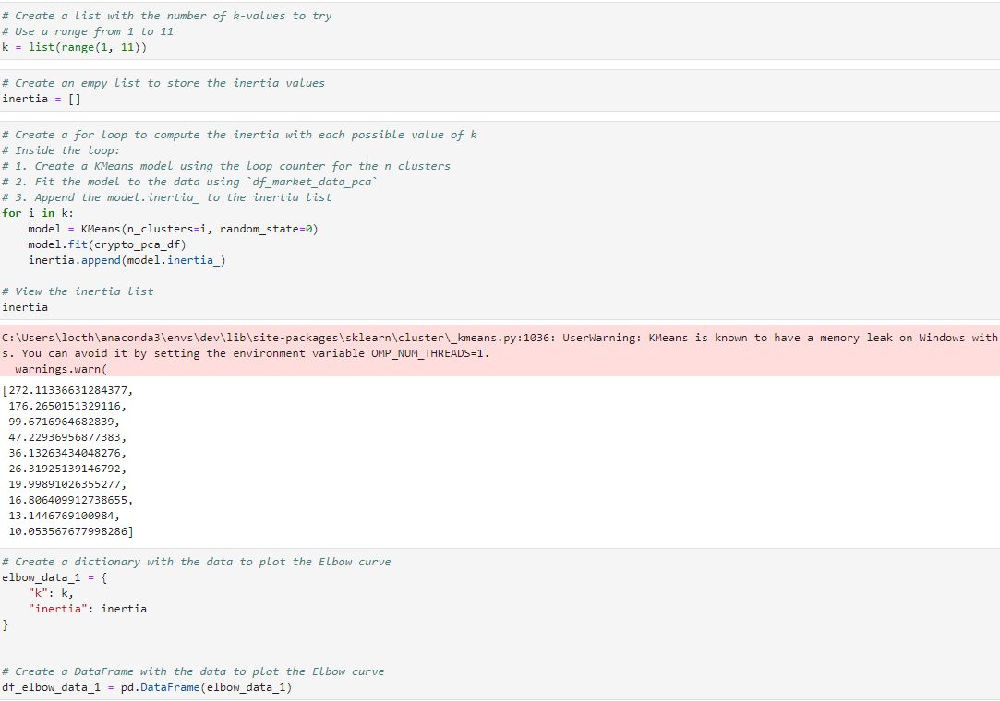
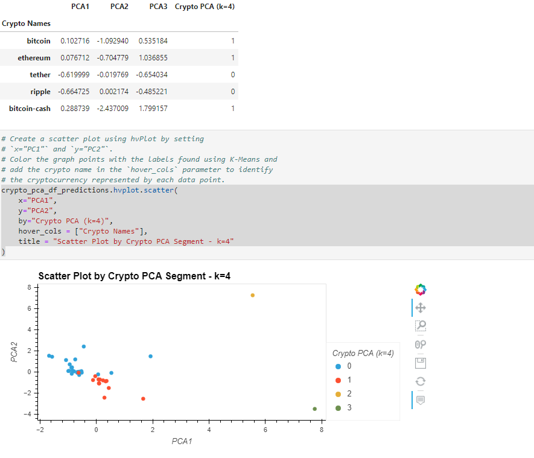
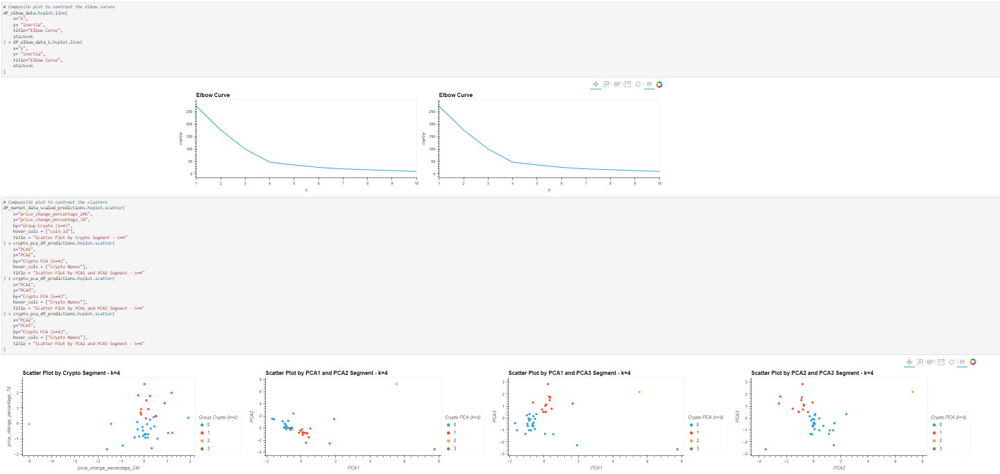

# Crypto-Clustering-Machine-Learning
To create a Jupyter notebook that clusters cryptocurrencies by their performance in different time periods. Then plot the results so that we can visually show the performance to the board.

The steps for this project are divided into the following sections:

1. Import the Data 
2. Prepare the Data 
3. Find the Best Value for k Using the Original Data
4. Cluster Cryptocurrencies with K-means Using the Original Data
5. Optimize Clusters with Principal Component Analysis
6. Find the Best Value for k Using the PCA Data
7. Cluster the Cryptocurrencies with K-means Using the PCA Data
8. Visualize and Compare the Results

---

## Technologies

This project leverages Anaconda and JupyterLab with Python 3.9:

* [Anaconda](https://www.anaconda.com/products/individual) 

Need to import the following libraries and dependencies:

```
import pandas as pd
import hvplot.pandas
from path import Path
from sklearn.cluster import KMeans
from sklearn.decomposition import PCA
from sklearn.preprocessing import StandardScaler
```

---

## Installation Guide

Before running the application first install the following dependencies.

1. Install [Anaconda](https://www.anaconda.com/products/individual) from link 
2. Open up GitBash(Windows) or Terminal(Mac)
3. Type ```conda update conda``` to update Conda
4. Type ```conda update anaconda``` to update Anaconda
5. Type ```conda create -n dev python=3.9 anaconda```
6. Type ```conda activate dev``` to activate conda
7. Install a dev environment kernel by typing ```python -m ipykernel install --user --name dev```
8. Install a node environment by typing ```conda install -c conda-forge nodejs```
9. Launch JupyterLab by typing ```jupyter lab```

If your terminal does not display scikit-learn and you need to install it, run the following:
```
pip install -U scikit-learn  
```
If you need to install the hvPlot library, run the following in your terminal:
```
conda install -c pyviz hvplot 
```
---

## Usage

You will need to clone the repo so that you can run the application:

```
 git clone https://github.com/locthai2002/Crypto-Clustering-Machine-Learning.git
```

Here are some screenshots from running the application:

### Import the Data



### Prepare the Data



### Find the Best Value for k Using the Original Data



### Cluster Cryptocurrencies with K-means Using the Original Data



### Optimize Clusters with Principal Component Analysis



### Find the Best Value for k Using the PCA Data



### Cluster the Cryptocurrencies with K-means Using the PCA Data



### Visualize and Compare the Results



---

## Contributors

Loc Thai -- www.linkedin.com/in/loc-thai-69b8a2141
Phone: 415.400.9998

---

## License

MIT
